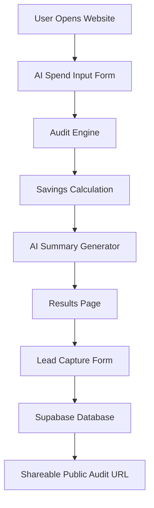

# ARCHITECTURE.md

# System Overview

AI Spend Audit is a lightweight SaaS-style web application that analyzes AI tooling costs for startups and engineering teams.

The application follows a client-first architecture with server-side persistence for audit reports and lead capture.

---

# System Diagram

---

# Data Flow

## 1. User Input

Users enter:
- AI tools
- subscription plans
- monthly spend
- number of seats
- primary use case

The frontend stores form state locally to preserve user progress across refreshes.

---

## 2. Audit Engine

The audit engine processes each tool individually using deterministic pricing and optimization rules.

Examples:
- recommending lower-cost plans for small teams
- identifying unnecessary enterprise subscriptions
- suggesting overlapping tool consolidation

The engine calculates:
- optimized spend
- monthly savings
- annual savings
- recommendation reasoning

The audit engine intentionally avoids using LLMs for pricing decisions to reduce hallucination risk.

---

## 3. AI Summary Generation

After savings calculations are complete, the application generates a concise AI-written optimization summary using an LLM API.

The summary layer:
- explains overspending
- highlights optimization opportunities
- maintains a professional SaaS tone

If the API fails, the application falls back to a deterministic template summary.

---

## 4. Results Rendering

The results page displays:
- total monthly savings
- annual savings
- per-tool recommendations
- AI-generated summary

High-savings audits prominently surface Credex consultation opportunities.

---

## 5. Lead Capture & Persistence

After value is shown, users can optionally submit:
- email
- company name
- role
- team size

Audit results and leads are stored in Supabase.

---

## 6. Shareable URLs

Each audit receives a public shareable URL.

Sensitive data such as:
- email
- company name

is excluded from public views.

The public audit page supports:
- Open Graph metadata
- Twitter card previews
- screenshot-friendly layouts

---

# Stack Decisions

## Next.js

Chosen for:
- App Router support
- dynamic routing
- metadata generation
- Vercel deployment simplicity
- strong TypeScript support

---

## TypeScript

Chosen for:
- safer audit calculations
- better maintainability
- clearer interfaces
- reduced runtime errors

---

## Tailwind CSS

Chosen for:
- rapid UI iteration
- responsive design
- lightweight styling workflow

---

## Supabase

Chosen for:
- fast backend setup
- hosted Postgres
- simple REST integration
- scalable persistence layer

---

# Scalability Considerations

If the application needed to support 10k+ audits/day:

## Planned Improvements

### 1. Move audit processing to server actions or API queues

This would reduce client-side processing overhead.

### 2. Introduce Redis caching

Pricing and optimization data could be cached to reduce repeated calculations.

### 3. Add analytics instrumentation

Track:
- audit completion rate
- lead conversion rate
- high-savings segments

### 4. Database indexing

Indexes would be added for:
- audit IDs
- timestamps
- lead queries

### 5. Rate limiting

Production deployment would include:
- IP-based throttling
- abuse prevention
- captcha protection

---

# Security Considerations

- No secrets stored in repository
- Environment variables used for API keys
- Public audit pages exclude sensitive lead data
- Minimal user data collection